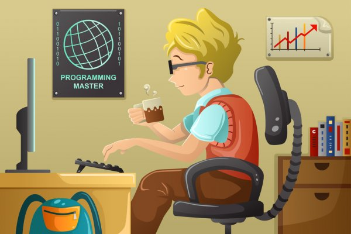

# <h1 align="center">Hi, I'm <a href="https://github.com/Samar-225">Samarsinh Salunkhe..<a></h1>
<!--      -->
    
    
<!-- 

    

 -->

<strong>About Me:</strong> 
  📚 I’m a Third year Computer Science undergraduate in Pune Institute of Computer Technology 
  <!-- 💻 I’m currently working as an intern at cakeSoft Technologies  -->

📫 Reach me at <a href="mailto:samarsinh225@gmail.com">samarsinh225@gmail.com</a> 
😄 Find me on <a href="https://www.linkedin.com/in/samarsinh/">Linkedin</a> 
🌻 View my <a href="https://twitter.com/Samarsinh_225">Twitter</a>   

<strong>📊 My Github Stats :</strong>  
 
  

<strong>💡 My Languages :</strong>  

 
  

<strong>🚀 My Latest Update :</strong>  

